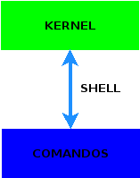
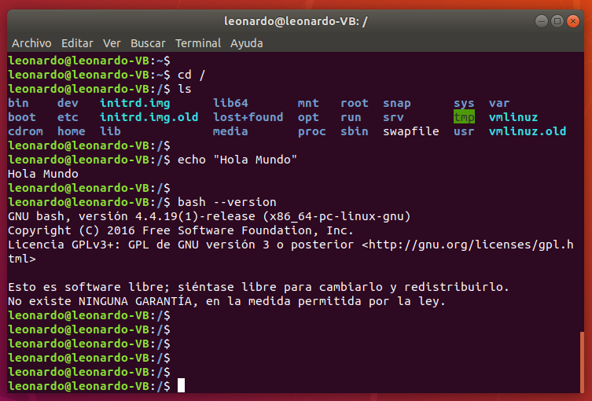
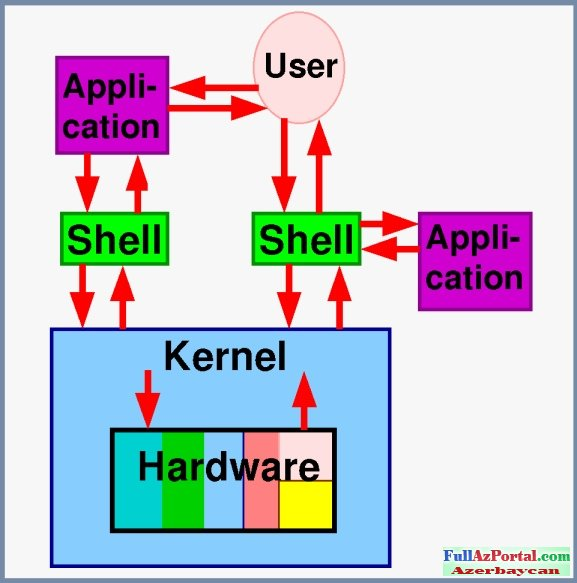

# Capacitación Linux


## Unix vs. Linux


## Usuarios

- Multiusuarios

```console
$ id -u username
```

Tipo de usuario
- root (superusuario o administrador)
- especiales (cuentas de sistema)
- normales

```console
$ cat /etc/passwd

root:x:0:0:root:/root:/bin/bash

bin:x:1:1:bin:/bin:/sbin/nologin
daemon:x:2:2:daemon:/sbin:/sbin/nologin
adm:x:3:4:adm:/var/adm:/sbin/nologin
lp:x:4:7:lp:/var/spool/lpd:/sbin/nologin
sync:x:5:0:sync:/sbin:/bin/sync
shutdown:x:6:0:shutdown:/sbin:/sbin/shutdown
halt:x:7:0:halt:/sbin:/sbin/halt
mail:x:8:12:mail:/var/spool/mail:/sbin/nologin
operator:x:11:0:operator:/root:/sbin/nologin
...
leonardo:x:1018:100:Usuario de Leonardo:/home/leonardo:/bin/bash
...
```

### Grupos

```console
$ cat /etc/group

root:x:0:
bin:x:1:
daemon:x:2:
sys:x:3:
adm:x:4:
...
users:x:100:user65247,user46293,user50222,user0970,user6920,user3162,user8340,user31959,user8339
...
```

## Intérprete de comandos (shell)







Cómo ejecuta un comando:
- orden interna
- alias
- path

Sintaxis:

```console
$ pepe
bash: pepe: command not found
```

```console
$ programa arg1 arg2 ... argn 
```

```console
$ programa1;programa2 arg1 arg2;programa3
```

```console
$ programa1 arg1 \
arg2 \
arg3
```