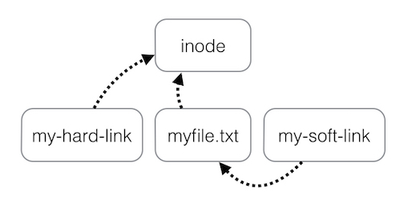

# 2. SISTEMA DE FICHEROS #


## Sistema Jerárquico ###

- Filesystem Hierarchy Standard (FHS).


## Rutas absolutas, relativas y directorio de trabajo ##

Paths:
- absolutos
- relativos

Comandos:
- **cd**: cambiar de directorio.
- **ls**: listar contenido de un directorio.


¿Cómo llegar desde el directorio F hasta el H?


```console
user@ubuntu:/A/B/F$ cd ../../D/H/
```


```console
user@ubuntu:/A/B/F/$ cd /A/D/H/
```

Notaciones especiales:
- ~: Directorio de usuario.
- \- : Histórico del último directorio accedido.
- .  : Directorio actual.
- .. : Directorio superior.

Ejemplos:

```console
leonardo@leonardo-VB:/A/B/F$ cd ~

leonardo@leonardo-VB:~$ pwd
/home/leonardo
```

```console
leonardo@leonardo-VB:~$ pwd
/home/leonardo

leonardo@leonardo-VB:~$ cd -
/A/B/F

leonardo@leonardo-VB:/A/B/F$ cd -
/home/leonardo
```

```console
leonardo@leonardo-VB:~$ ls .
code  Descargas  Documentos  Escritorio  Imágenes  Música  Plantillas  Público  snap  svn  Vídeos  workspace

leonardo@leonardo-VB:~$ ls
code  Descargas  Documentos  Escritorio  Imágenes  Música  Plantillas  Público  snap  svn  Vídeos  workspace
```

```console
leonardo@leonardo-VB:~/code/scripts$ pwd
/home/leonardo/code/scripts

leonardo@leonardo-VB:~/code/scripts$ cd ..

leonardo@leonardo-VB:~/code$ pwd
/home/leonardo/code
```

## Directorio de trabajo

\# 1
```console
user@ubuntu:/A/D/H/$ pwd
/A/D/H/
```

```console
user@ubuntu:/home/user/workspace/$ pwd
/home/user/workspace/
```

\# 2
```console
[user@ubuntu H]$ pwd
/A/D/H/
```

```console
[user@ubuntu workspace]$ pwd
/home/user/workspace/
```

## Directorio $HOME ##

- /home/**[username]**/
- cd

Ej:
- /home/user1/
- /home/user2/
- /home/user3/

### Archivos de configuración

```console
$ pwd
/home/leonardo
$ ls -la
drwx------ 2 ana  ana  4096 jul  9 09:54 .
drwxr-xr-x 7 root root 4096 jul  9 09:54 ..
-rw-r--r-- 1 ana  ana    24 jul  9 09:54 .bash_logout
-rw-r--r-- 1 ana  ana   191 jul  9 09:54 .bash_profile
-rw-r--r-- 1 ana  ana   124 jul  9 09:54 .bashrc
```

## Mover, renombrar y copiar ficheros ##

- mv
- cp

```console
[user@ubuntu workspace]$ mv hola-mundo.java hello-world.java
```

```console
[user@ubuntu workspace]$ cp hola-mundo.java hola-mundo.java.backup
```

```console
[user@ubuntu workspace]$ cp hola-mundo.java ../hola-mundo.java
```

## WildCards ##

- **\*** coincidirá con uno o más caracteres.
- **?** coincidirá exactamente con un carácter.
- **[]** coincidirá con cualquier ocurrencia de caracteres listados.

Ejemplos: \*
```console
#1
leonardo@leonardo-VB:~/Descargas$ ls file-2019-07-*

#2
leonardo@leonardo-VB:~/Descargas$ ls file-2019-07-*.csv

#3
leonardo@leonardo-VB:~/Descargas$ mv file-2019-06-*.csv ../Documentos/files/junio/
```

Ejemplos: ?
```console
#1
leonardo@leonardo-VB:~/Descargas$ ls
house mouse grouse

leonardo@leonardo-VB:~/Descargas$ ls ?ouse
house mouse

#2
leonardo@leonardo-VB:~/Descargas$ ls
list.sh speaker.sh lost.sh 

leonardo@leonardo-VB:~/Descargas$ ls l?st.sh
list.sh lost.sh
```

Ejemplos: []
```console
#1
leonardo@leonardo-VB:~/Descargas$ ls
file-2019-06-24-01-00-00.csv
file-2019-06-24-02-00-00.csv
file-2019-06-24-03-00-00.csv
file-2019-06-24-04-00-00.csv
file-2019-06-24-05-00-00.csv
file-2019-06-24-06-00-00.csv 

leonardo@leonardo-VB:~/Descargas$ cp file-2019-06-24-0[4-6]-*.csv backup

#2
leonardo@leonardo-VB:~/Descargas$ ls [m]ouse
list.sh speaker.sh lost.sh 

leonardo@leonardo-VB:~/Descargas$ ls l[aeiou]st.sh
list.sh lost.sh

#3
leonardo@leonardo-VB:~/Descargas$ ls l[a-zA-Z]st.sh
list.sh lost.sh
```

## Obtener información sobre archivos y directorios ##

- dueño
- tamaño
- permisos del archivo

Comando **ls**

```console
# ls -l:  Muestra usuario, grupo, permisos, tamaño, fecha y hora.

# ls -lh: Idem, pero con unidades de tamaño para "humano" (Kb, Mb, Gb).

# ls -a:  Incluye en el listado los archivos y directorios ocultos.

# ls -t:  Ordena por fecha de modificación.

# ls -X:  Ordena los archivos por extensión.

# ls -S:  Ordena los resultados por tamaño de archivo.
```

Comando **ls -l**


Ejemplos:

```console
#1
ls -l file.tar.gz 
-rw-r--r-- 1 leonardo leonardo 5121721 jun 23 16:48 file.tar.gz

#2
ls -lh file.tar.gz 
-rw-r--r-- 1 leonardo leonardo 4,9M jun 23 16:48 file.tar.gz

#3
ls -lh Descargas/
total 4,9M
-rw-r--r-- 1 leonardo leonardo 4,9M jun 23 16:48 1.20.0.tar.gz
drwxr-xr-x 2 leonardo leonardo 4,0K jun 23 17:41 otros
drwxr-xr-x 2 leonardo leonardo 4,0K jun 23 17:43 varios
```


## Permisos ##

Consultar los permisos:


Asignar permisos:

```console
chmod [permisos] [file]

chmod -R [permisos] [directory]
```


```console
chmod 755 file.txt
```

```console
chmod -R 755 /other/directory/
```

## Información sobre el sistema de archivos ##

- df: Disk Free
- du: Disk Usage

```console
df -h
```


```console
du -sh
```


## Compresión y descompresión de ficheros ##

- gzip
- bzip
- gunzip
- bunzip
- tar
- zcat

### GZIP

```console
Comando: gzip
```

Comprimir:

```console
gzip filename
```

```console
gzip file1 file2 file3
```

Descomprimir:

```console
gzip -d filename.gz
```

Parámetros útiles:

```console
gzip -f filename

# -f: force
```

```console
gzip -f filename

# -k: keep the original file
```

```console
gzip -r foldername

# -r: recursive
```

```console
gzip -t filename

# -t: test
```

### BZIP

```console
Comando: bzip2
```

Comprimir:

```console
bzip2 myfile.txt

# Result: myfile.txt.bz2
```

```console
bzip2 -k myfile.txt

# Result: myfile.txt myfile.txt.bz2
```

```console
bzip2 file1 file2 file3
```

Descomprimir

```console
bzip2 -d myfile.txt.bz2
```


### GUNZIP

```console
Comando: gunzip
```

Descomprimir
```console
gunzip workspace.gz
```

```console
gunzip -k workspace.gz
```

```console
gunzip -t workspace.gz
```

### BUNZIP

```console
Comando: bzip2
```

Comprimir
```console
bzip2 filename

# Result: filename.bz2
```

Descomprimir

```console
bunzip2 filename.bz2
```

### ZIP

```console
Comando: zip
```

Comprimir
```console
zip myfile.zip filename.txt
```

Descomprimir

```console
unzip filename
```

### TAR

```console
Comando: tar
```

Empaquetar/Comprimir

```console
tar -cvf workspace.tar workspace
```

```console
gzip workspace.tar
```

Todo en uno:

```console
tar -cvzf workspace.tar.gz workspace
```

Desempaquetar/Descomprimir

```console
gunzip workspace.tar.gz
```

```console
tar -xvf workspace.tar
```

Todo en uno:

```console
tar -xvzf workspace.tar.gz
```

Parametros
```console
c – create a archive file.
x – extract a archive file.
v – show the progress of archive file.
f – filename of archive file.
z – filter archive through gzip.

Nota: tar.gz = tgz
```

### ZCAT

```console
Comando: zcat
```

Mostrar contenido:

```console
zcat workspace.gz
```

```console
zcat workspace.gz | more
```

```console
zcat workspace.gz | less
```


## Enlaces duros y blandos (simbólicos) ##

### > Comandos:

```consola
ln [OPCIONES] enlace

$ ln

# Para crear enlaces.
```

```consola
$ ln -s

# s: Especifica crear enlaces blandos (soft links).
```

```consola
ls [OPTION]... [FILE]... 

$ ls -li

# ls: Lista el contenido de un directorio.
# l:  Expande información, formato largo de lista.
# i:  Imprime el índice del inodo.
```

### > inode




### > Enlaces duros, fuertes o **hard links**:


```consola
leonardo@leonardo-VB:~/Documentos$ ls -li origin.txt 
1709566 -rw-r--r-- 1 leonardo leonardo 12 jun 17 11:23 origin.txt

leonardo@leonardo-VB:~/Documentos$ ln origin.txt enlace-to-origin.txt

leonardo@leonardo-VB:~/Documentos$ ls -li enlace-to-origin.txt 
1709566 -rw-r--r-- 2 leonardo leonardo 12 jun 17 11:23 enlace-origin.txt

leonardo@leonardo-VB:~/Documentos$ ls -li origin.txt 
1709566 -rw-r--r-- 2 leonardo leonardo 12 jun 17 11:23 enlace-origin.txt
```


### Enlaces duros recursivos

```consola
leonardo@leonardo-VB:~/Documentos$ cp -rl my_directory /home/leonardo/my_directory

# cp: Copiar
# r:  Recursivo.
# l:  Enlace duro.
```
### > Enlaces simbólicos, blandos, symlink o **soft links**:

```consola
leonardo@leonardo-VB:~/Documentos$ ls -li origin.txt 
1709566 -rw-r--r-- 1 leonardo leonardo 12 jun 17 11:23 origin.txt

leonardo@leonardo-VB:~/Documentos$ ln -s /home/leonardo/Documentos/origin.txt /home/leonardo/Escritorio/enlace-soft-origin.txt

leonardo@leonardo-VB:~/Documentos$ ls -li origin.txt 
1709566 -rw-r--r-- 1 leonardo leonardo 12 jun 17 11:23 origin.txt

leonardo@leonardo-VB:~/Documentos$ cd ../Escritorio/
leonardo@leonardo-VB:~/Escritorio$ ll
lrwxrwxrwx  1 leonardo leonardo   36 jun 17 11:23 enlace-soft-origin.txt -> /home/leonardo/Documentos/origin.txt

leonardo@leonardo-VB:~/Escritorio$ ls -li enlace-soft-origin.txt 
790230 -rw-r--r-- 1 leonardo leonardo 36 jun 17 11:23 enlace-soft-origin.txt -> /home/leonardo/Documentos/origin.txt
```

**Importante:** Siempre usar paths absolutos para enlaces simbólicos.

### Crear enlaces simbólicos recursivos de todo un directorio

```consola
leonardo@leonardo-VB:~/Documentos$ cp -rs /home/leonardo/Documentos/my_directory /home/leonardo/Escritorio/my_directory

# cp: Copiar
# r:  Recursivo.
# s:  Enlace simbólico.
```

## Acceso remoto ##


- ssh
- scp
- wget

### SSH

Clientes:
- Terminal (Linux y Mac)
- Termius (Multiplataforma)
- Putty (Windows)
- MobaXterm (Windows)
- Otros

```consola
leonardo@leonardo-VB:~$ ssh leonardo@192.168.50.123

# ssh usuario@[IP]:[puerto]

# usuario:  Nombre del usuario.
# host:     IP o nombre de dominio.
# puerto:   Por defecto es el 22.
# password: Password del usuario.
```


### SCP

```consola
# scp [[user@]host1:]file1 ... [[user@]host2:]file2

# scp -> Copiar archivos por medio de una conexión segura.

# [[user@]host1] -> Usuario y host del server origen.
# [[user@]host2] -> Usuario y host del server destino.

# En ambos casos -> Si no se especifica server (ip/host) origen o destino, se asume que el destino de los archivos es local.

# :file1 y :file2 -> Archivo/s a transferir.
```

Ejemplos:

```consola
# Copiar un archivo local a un destino remoto

#1
leonardo@leonardo-VB:~$ scp /home/leonardo/archivo-origen.txt usuario1@HOST:/home/usuario1/directorio-destino/

#2
leonardo@leonardo-VB:~$ scp archivo-origen.txt usuario1@HOST:/home/usuario1/directorio-destino/
```

```consola
# Copiar un archivo de un destino remoto al local

leonardo@leonardo-VB:~$ scp usuario1@HOST:/home/usuario1/datos/archivo-origen /home/leonardo/directorio-destino
```

```consola
# Copiar un archivo de un ordenador remoto a otro ordenador remoto

leonardo@leonardo-VB:~$ scp user1@server1:/path/to/file user2@server2:/path/to/folder/
```

```consola
# Copiar un único archivo de un servidor remoto al mismo servidor remoto, pero en otro directorio

leonardo@leonardo-VB:~$ scp user1@server1:/path/to/file user1@server1:/path/to/other/folder/
```

```consola
# scp /ruta/al/directorio/* usuario@servidor:/ruta/al/directorio/

leonardo@leonardo-VB:~$ scp /ruta/al/directorio/* usuario@servidor:/ruta/al/directorio/
```

### WGET

```consola
leonardo@leonardo-VB:~$ wget https://github.com/iluwatar/java-design-patterns/archive/1.20.0.tar.gz
```


