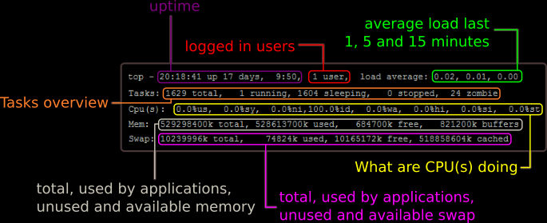
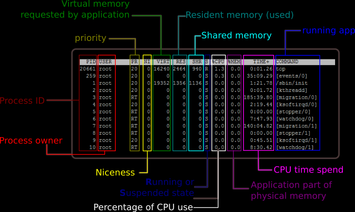

# 3. CONTROL DE PROCESOS #

- ps
- kill
- free
- top
- screen

## ps (process status)

Ejemplos de uso frecuente:

```console
$ ps
```

```console
$ ps aux
```

```console
$ ps aux | grep XXXXX
```

```console
$ ps -u root -N 
```

```console
$ ps axo user,pid,comm

# Personalizar los atributos a mostrar de los procesos.
```

```console
$ ps -ef

# Ver todos los procesos del sistema (en formato completo)
```

```console
$ ps aux --sort cputime
```

## kill

```console
$ kill pid_del_proceso
```

```console
$ kill -9 pid_del_proceso
```

```console
$ ps aux | grep XXXXX
$ kill -9 pid_del_proceso
```

## free

```console
$ free

total used free shared buffers cached
Mem: 8027952 4377300 3650652 103648 1630364
-/+ buffers/cache: 2643288 5384664
Swap: 15624188 608948 15015240
```

```console
free -m
```

```console
free -h
```

```console
free -s 3
```

```console
free -s 3 -c 5
```

```console
free -t
```

## top

```console
$ top
```

|  | 
|:--:| 
| *Image from: https://www.svennd.be/wp-content/uploads/2017/02/top_top.png* |


|  | 
|:--:| 
| *Image from: https://www.svennd.be/wp-content/uploads/2017/02/top_tail.png* |

### Load Average explicación:
- https://aplicacionesysistemas.com/load-average-carga-de-cpu-en-linux/

Tip:
```console
$ top -bcn1 -w512
```

## screen

```console
$ screen
```

```console
$ screen -ls
```

```console
$ screen -r ID
```

```console
$ screen -S NAME
```

```console
$ echo $STY
```


```console
ctrl + a

d: detach 
S: Split current region horizontally into two regions
c: Create a new window (with shell)
X: Close the current region
```