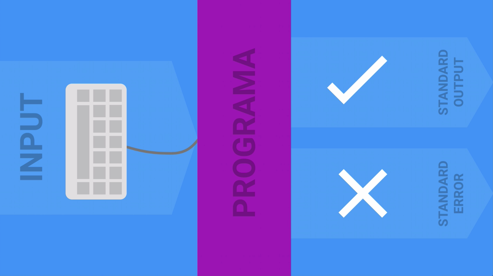
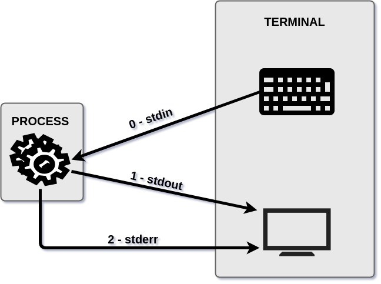
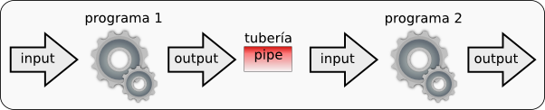

# 4. FLUJOS DE INFORMACIÓN #

## Redirigir flujos de información ##



 ### Flujos de E/S (Entrada y Salida)

|Nombre|Descriptor de fichero|Destino por defecto|
|---|---|---|
|entrada estándar (stdin)|0|teclado|
|salida estándar (stdout)|1|pantalla|
|error estándar (stderr)|2|pantalla|



### Cambiar la entrada/salida: 

- Redireccionar la salida

|Carácter|Resultado|
|-|-|
|comando > fichero |	Envía la salida de comando a fichero|; sobreescribe cualquier cosa de fichero|
|comando 2> fichero|	Envía la salida de error de comando a fichero (el 2 puede ser reemplazado por otro descriptor de fichero)|
comando >> fichero 	|Añade la salida de comando al final de fichero|
comando 2>&1 |	Envía la salida de error a la salida estándar (el 1 y el 2 pueden ser reemplazado por otro descriptor de fichero, p.e. 1>&2)|
comando &> fichero |	Envía la salida estándar y de error a fichero; equivale a comando > fichero 2>&1|
|aplicación 2 > /dev/null|Descartar salida error|


- Redireccionar la entrada

|Carácter|Resultado|
|-|-|
|comando < fichero |	Toma la entrada de fichero|

- Ejemplo:
```console
ls -l /home/pruebas 1> exito.txt
ls -l /home/pruebas 2> error.txt

cat exito.txt
cat error.txt
```

```console
mycommand > mycommand.out 2> mycommand.err
```

```console
wc < archivo.txt
```

```console
grep < archivo.txt "Hola"
```

## Pipes (o Tuberías) ##

```console
comando1 | comando2
```




```console
cat archivo.txt | wc
```

```console
cat archivo.txt | grep "Hola"
```