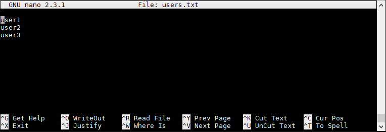

# 5. PROCESAMIENTO DE FICHEROS DE TEXTO #



## Impresión de ficheros ##

- cat
- head
- tail

### cat

```console
$ cat myfile
```

```console
$ cat myfile1 myfile2
```

```console
# Parametros útiles:

-n: Numera todas las líneas de salida.

-b: Número de líneas de salida no vacías.
```

Copiar contenido a otro archivo:

```console
$ cat myfile > myfile-new
```

```console
$ cat myfile >> myfile-new
```

```console
$ cat myfile1 myfile2 > myfile-new
```

### head

```console
$ head myfile
```
```console
$ head -5 myfile
```
```console
$ head -c5 myfile
```

### tail

```console
$ tail myfile
```

```console
$ tail -5 myfile
```

```console
$ tail -f myfile
```

```console
# Parametros útiles:

-n: muestra las últimas n líneas del archivo.

-f: muestra las últimas líneas de un archivo en tiempo real.
```

## Navegación de ficheros ##

- less

|  | 
|:--:| 
| *Image from: https://linuxhandbook.com/wp-content/uploads/2018/08/less-command-examples-linux-featured.png* |

```console
$ less myfile
```

Argumentos útiles:

```console
$ less -N myfile

# Mostrar número de cada línea
```

```console
$ less -p BUSCAR_ALGO myfile
```

```console
$ less +n myfile

# Muestra el archivo desde la linea n
```

```console
$ less -M myfile

# Muestra información: cantidad de lineas, % de avance
```

```console
$ file * | less

# Para inspeccionar directorios con muchos archivos
```

```console
$ less -S myfile

# Deshabilitar auto-ajuste de líneas
```

```console
$ less +F myfile

# Idem a: tail -f myfile
```

Comandos:
```console
Navegación:

- Teclas de Flechas/AvPag/RePag/Inicio/Fin: .
- g: Ir al final del texto. 
- G: Ir al inicio del texto. 
- Ng: Saltar a línea número N.

Búsqueda:

- /: Ingresar una palabra a ser buscada avanzando dentro del texto. Se pueden utilizar expresiones regulares.
- ?: Ingresar una palabra a ser buscada retrocediendo dentro del texto. Se pueden utilizar expresiones regulares.
- n: Ir a siguiente coincidencia (después de una búsqueda).
- N: Ir a coincidencia anterior (después de una búsqueda).

- q: salir
```

## Edición de ficheros ##

- wc
- grep
- cut
- sed
- sort
- uniq
- shuf


### wc (word count) 

Parámetros:

```console
$ wc -l myfile

# número de lineas 
```

```console
$ wc -m myfile

# imprime el número de caracteres
```

```console
$ wc -L myfile

# imprime la longitud de la línea más larga
```

```console
$ wc -w myfile

# imprime el número de palabras
```

Ejemplos:

```console
$ wc -l *.txt

  240 countries.txt
  104 iso_8859-1.txt
    8 linux.txt
    3 users.txt
  355 total
```

```console
$ cat /etc/passwd | grep /home | wc -l 
   3
```

```console
$ ls | wc -l
```

### grep (Global Regular Expression Print)

```console
$ grep option search_pattern myfile
```

Parámetros y formas de usar:

```console
$ grep PALABRA myfile
```

```console
$ grep PALABRA *.txt
```

```console
$ grep PALABRA *.txt > resultados.txt
```

```console
$ grep -i PALABRA *.txt

# case insensitive
```

```console
$ grep -r PALABRA /home/user1/
```

```console
$ grep -n PALABRA *.txt

# mostrar el número de línea en el que coincide el patrón
```

```console
$ grep -color PALABRA *.txt
```

```console
Otros parámetros:

-E nos permite usar expresiones regulares. Equivalente a usar egrep.
-H nos imprime el nombre del archivo con cada coincidencia.
```

### cut

```console
$ cut options myfile

# Parámetros más usados:

-f: Selecciona los campos (columnas) indicadas en el o los rangos.
-d: Especifica el caracter delimitador de los campos,
-s: Indica que las líneas que no posean el delimitador (o separador) no sean mostradas.
--output-delimiter: Indica que los campos, al ser mostrados en pantalla, sean separados por la cadena de texto indicada.
```

Ejemplos, casos típicos:

```console
$ cat archivo.csv
dato1,dato2,dato3,dato4,dato5,dato6

$ cut -f 2-4 -d "," archivo.csv
dato2,dato3,dato4

$ cut -f 2,4 -d "," archivo.csv
dato2,dato4

$ cut -f 2 -d "," archivo.csv
dato2
```

```console
$ echo "dato1,dato2,dato3,dato4,dato5,dato6" | cut -f 2-4 -d ","

dato2,dato3,dato4
```

```console
$ cut -f 2-4 -d "," --output-delimiter="|" archivo.csv

dato2|dato3|dato4
```

```console
$ cut -f 2-4 -d "," --output-delimiter="|" archivo.csv > salida.txt

$ cat salida.txt
dato2|dato3|dato4
```

### sed

```console
sed [-ns] '[direccion] instruccion argumentos'

$ sed [opciones] myfile
$ sed [opciones]  myfile > salida.txt  
$ comando1 | sed [opciones]
$ comando1 | sed [opciones] > salida.txt
```

```console
$ sed [-ns] '[direccion] instruccion argumentos'

[direccion] es opcional, siendo un número de línea (N), rango de números de línea (N,M) o búsqueda de regexp (/cadena/) indicando el ámbito de actuación de las instrucciones. Si no se especifica [direccion], se actúa sobre todas las líneas del flujo.

Instruccion puede ser:
    i = Insertar línea antes de la línea actual.
    a = Insertar línea después de la línea actual.
    c = Cambiar línea actual.
    d = Borrar línea actual.
    p = Imprimir línea actual en stdout.
    s = Sustituir cadena en línea actual.
    r fichero = Añadir contenido de "fichero" a la línea actual.
    w fichero = Escribir salida a un fichero.
    ! = Aplicar instrucción a las líneas no seleccionadas por la condición.
    q = Finalizar procesamiento del fichero.

    -n: No mostrar por stdout las líneas que están siendo procesadas.

    -s: Tratar todos los ficheros entrantes como flujos separados.
```

### Ejemplos de uso:

Imprimir líneas:

```console
$ sed -n '1p' myfile

$ sed -n '5,10p' myfile
```

Eliminar líneas

```console
$ sed '5d' myfile

$ sed '2,7 d' myfile

$ sed '/cadena-texto/d' myfile
```

Insertar y agregar texto:

```console
$ sed '2i\insertar este texto arriba de la 2da línea.' myfile
```

```console
$ sed '2a\insertar este texto abajo de la 2da línea.' myfile
```

Sustitución de líneas:
```console
$ sed '3c\Cambio la tercera linea de texto' myfile
```

Sustitución de texto

```console
$ echo "Hola Mundo" | sed 's/Mundo/Linux/'
Hola Linux

$ sed 's/texto/otro texto/' myfile > salida.txt
```

```console
$ echo "Hola Mundo Mundo" | sed 's/Mundo/Linux/'
Hola Linux Mundo

$ echo "Hola Mundo Mundo" | sed 's/Mundo/Linux/g'
Hola Linux Linux

# g = global
```

```console
$ echo "Hola Mundo Hola" | sed 's/Hola/(&)/'
(Hola) Mundo Hola

$ echo "Hola Mundo Hola" | sed 's/Hola/(&)/g'
(Hola) Mundo (Hola)
```

```console
$ sed '1,10 s/cadena1/cadena2/g' myfile

# Sustituir apariciones de cadena1 por cadena2 en las líneas 1 a 10
```

```console
$ sed 's/[2-5]/Numero &/' myfile

# Regular expresion
```

```console
 $ sed -e 's/This/That/; s/test/another test/' ./myfile
```

### sort

```console
$ sort myfile

$ sort myfile > salida-ordenada.txt
```

```console
$ sort myfile1 myfile2
```

Parámetros útiles:

```console
    -f : Las mayúsculas y las minúsculas se van a tratar de forma diferente.

    -n : Ordenar los campos numéricos por su valor numérico.

    -r : Ordenación inversa (de mayor a menor).

    -knumero : Por cual columna o campo vamos a realizar la ordenación.

    -t: Configura un delimitador de campo. Por default es el espacio en blanco.
    
    -u: Suprimir todas las líneas repetidas después de la ordenación.

    -o myfile: Escribir el resultado en "myfile".
```

Ejemplos:

```console
$ cat /etc/passwd | sort -t":" -k3nr
```

```console
$ sort -o myfile -u myfile
```

### uniq

```console
$ uniq myfile
```

Parámetros:
```console
-d: muestra una sola ocurrencia de las líneas duplicadas.

-u: muestra las líneas que no poseen repeticiones.

-c: cuenta el número de ocurrencias de cada renglón.

-i: se ignora las Mayúsculas/Minúsculas al hacer la comparación.

-f: ignorar los N primeros campos.
```

### shuf

```console
$ shuf-i 1-999-n 10
```

```console
$ cat numeros.txt
1
2
3
4
5
6
7
8
9

$ shuf numeros.txt
8
7
9
4
3
2
6
5
1

$ shuf -n 3 numeros.txt
1
2
4

$ shuf -e 1 2 3 4 5 6 7 8 9
3
7
9
```

## Unir ficheros ##

- paste
- join

### paste

```console
$ cat dnis.txt
11111111
22222222
33333333

$ cat nombres.txt
Homero Simpson
Apu Nahasapeemapetilon
Willie el jardinero

# cat paises.txt
Estados Unidos
India
Escocia

$ paste dnis.txt nombres.txt paises.txt
11111111        Homero Simpson  Estados Unidos
22222222        Apu Nahasapeemapetilon  India
33333333        Willie el jardinero     Escocia

$ paste -d : dnis.txt nombres.txt paises.txt
11111111:Homero Simpson:Estados Unidos
22222222:Apu Nahasapeemapetilon:India
33333333:Willie el jardinero:Escocia
```

```console
$ paste -s dnis.txt nombres.txt paises.txt
11111111        22222222        33333333
Homero Simpson  Apu Nahasapeemapetilon  Willie el jardinero
Estados Unidos  India   Escocia

```

### join

```console
$ cat ejemplo1.txt
jorge sandra
maría juan

$ cat ejemplo2.txt
alberto marta
jorge sofía

$ join ejemplo1.txt ejemplo2.txt
jorge sandra sofía
```

## Manipulación de cadenas de texto ##

- extraer
- borrar
- reemplazar

```console
$ echo "texto" | comando
```